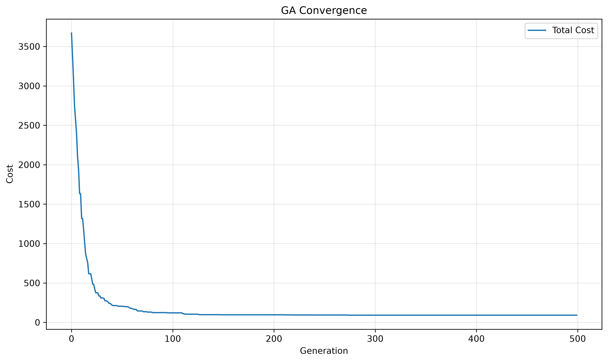
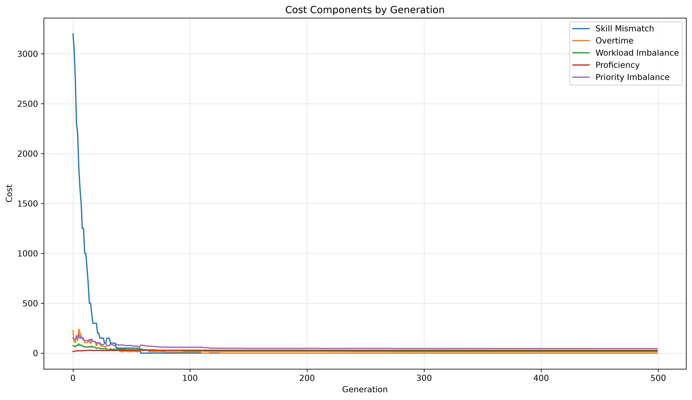
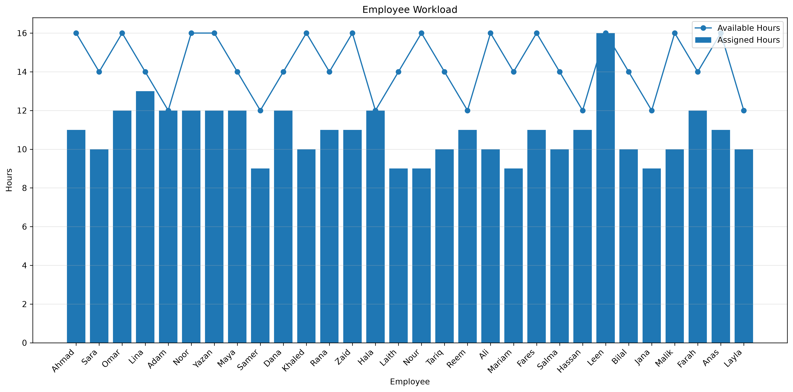
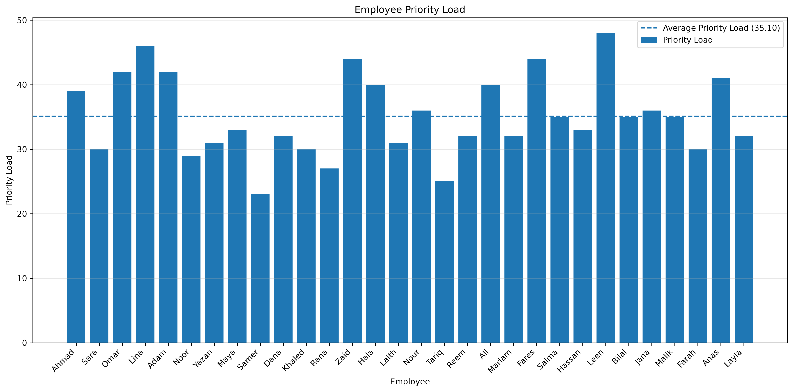

# Genetic Algorithm Task Scheduler 🧬


A task scheduling system that uses a **Genetic Algorithm** to assign tasks to employees while balancing skills, proficiency, availability, workload, and task priority.

The project was built from scratch in Python and evolved from a basic GA implementation into a configurable optimization system with automated experiments, visualization, testing, and CI.

---

## Features

- Multi-skill task assignment
- Employee skill proficiency levels
- Employee availability constraints
- Workload and task priority balancing
- Tournament selection and elitism
- One-point, two-point, and uniform crossover
- Configurable GA and fitness parameters using TOML
- Human-readable schedule reports
- Automated parameter experiments
- Result visualizations
- Pytest unit tests
- GitHub Actions CI

---

## How It Works

Each possible schedule is represented as a **chromosome**.

```text
Chromosome:

[2, 0, 4, 1]

Task 0 → Employee 2
Task 1 → Employee 0
Task 2 → Employee 4
Task 3 → Employee 1
```

Each gene represents a task, while its value represents the employee assigned to that task.

The Genetic Algorithm repeatedly improves a population of schedules:

```text
Population
    ↓
Tournament Selection
    ↓
Crossover
    ↓
Mutation
    ↓
Elitism
    ↓
Next Generation
```

The process continues for a configurable number of generations while attempting to minimize scheduling cost.

---

## Fitness Function

Each schedule is evaluated using five cost components.

| Cost | Purpose |
| --- | --- |
| **Skill Mismatch** | Penalizes missing required skills |
| **Overtime** | Penalizes assignments beyond employee availability |
| **Workload Imbalance** | Encourages balanced working hours |
| **Proficiency** | Measures differences between required and employee skill levels |
| **Priority Imbalance** | Prevents high-priority work from concentrating on a few employees |

The objective is:

```text
Total Cost =
Skill Mismatch
+ Overtime
+ Workload Imbalance
+ Proficiency
+ Priority Imbalance
```

The Genetic Algorithm attempts to **minimize the total cost**.

Fitness penalties and weights are configurable in:

```text
config/fitness.toml
```

---

## Dataset

The final dataset contains:

```text
30 Employees
70 Tasks
```

Employees contain:

- Skills and proficiency levels
- Available working hours

Tasks contain:

- Required skills and proficiency levels
- Estimated hours
- Priority

Tasks may require between **1 and 3 skills**.

The dataset was validated so every task has at least one employee capable of satisfying its required skills and proficiency levels.

---

## Configuration

Genetic Algorithm parameters are stored in:

```text
config/genetic_algorithm.toml
```

The final configuration is:

```toml
population_size = 200
generations = 500
mutation_rate = 3
tournament_size = 9
elite_size = 4
crossover_type = "uniform"
```

Fitness penalties are stored separately in:

```text
config/fitness.toml
```

This allows the scheduler to be configured without modifying the implementation.

---

## Results

Because Genetic Algorithms are stochastic, results vary between runs.

The final configuration was evaluated across **30 independent runs**.

| Metric | Result |
| --- | ---: |
| Average Cost | **85.87** |
| Median Cost | 85.59 |
| Best Cost | **73.36** |
| Worst Cost | 97.34 |
| Standard Deviation | 5.18 |
| Average Runtime | 7.17 s |
| No Skill Mismatch | **100%** |
| No Overtime | **93.33%** |

A total of **360 Genetic Algorithm runs** were performed during parameter experiments and final configuration validation.

Detailed experiment results, parameter comparisons, and visualizations are available in:

**[Experiments & Results](experiments/README.md)**

---

## Example Run

One execution using the final configuration produced:

```text
Execution time: 7.209 seconds

Generation 273
------------------------------
Total Cost:          90.88
Skill Mismatch Cost: 0.00
Overtime Cost:       0.00
Imbalance Cost:      16.70
Proficiency Cost:    28.10
Priority Cost:       46.08
------------------------------
```

The resulting schedule contained **no skill mismatches and no employee overtime**.

<details>
<summary><strong>View Run Visualizations</strong></summary>

<br>

### Cost Convergence

<p align="center">
  
</p>

### Cost Components

<p align="center">
  
</p>

### Employee Workload

<p align="center">
  
</p>

### Employee Priority Load

<p align="center">
  
</p>

</details>

---

## Experiments

The project includes an automated experiment framework for evaluating Genetic Algorithm parameters across repeated runs.

It was used to compare:

- Crossover operators
- Mutation rates
- Tournament sizes
- The final combined configuration

For example, a parameter can contain multiple values:

```toml
mutation_rate = [1, 3, 5, 10]
```

Each value is then evaluated across multiple independent runs while the remaining parameters stay fixed.

A complete configuration can also be evaluated repeatedly:

```toml
mutation_rate = 3
tournament_size = 9
crossover_type = "uniform"
```

Run experiments with:

```bash
poetry run python -m experiments.main
```

The full methodology, tables, plots, and analysis are documented in:

**[experiments/README.md](experiments/README.md)**

---

## Schedule Report

The best chromosome is converted into a human-readable schedule report containing:

- Overall cost breakdown
- Employee workload
- Employee priority load
- Assigned tasks
- Available and assigned hours
- Required skills and proficiency levels
- Employee skill levels
- Task hours and priority

This makes the result easier to inspect than raw chromosome indices.

---

## Testing & CI

Core GA components are covered by **15 pytest tests**, including fitness functions, crossover, mutation, and preprocessing.

```bash
poetry run pytest
```

GitHub Actions automatically runs the test suite on pushes and pull requests.

---

## Project Structure

```text
Genetic-Algorithm-Task-Scheduler/
│
├── .github/workflows/       # CI
├── config/                  # GA, fitness and experiment configuration
├── data/                    # Employee and task datasets
├── experiments/             # Experiment framework and results
├── results/                 # Generated reports and plots
├── src/                     # Core GA implementation
├── tests/                   # Unit tests
│
├── main.py
├── pyproject.toml
├── poetry.lock
├── README.md
└── LICENSE
```

---

## Running the Project

Requires **Python >=3.12,<3.14** and [Poetry](https://python-poetry.org/).

Clone the repository:

```bash
git clone https://github.com/ahmadmrr/Genetic-Algorithm-Task-Scheduler.git
cd Genetic-Algorithm-Task-Scheduler
```

Install dependencies:

```bash
poetry install
```

Run the scheduler:

```bash
poetry run python main.py
```

Run tests:

```bash
poetry run pytest
```

Run experiments:

```bash
poetry run python -m experiments.main
```

---

## Versions

**v1.0** — Basic Genetic Algorithm scheduler with skill mismatch, overtime, selection, crossover, mutation, and elitism.

**v1.5** — Added workload balancing and improved cost tracking.

**v2.0** — Added proficiency constraints, performance improvements, larger datasets, and schedule reporting.

**v3.0** — Added multi-skill tasks, availability, priority balancing, multiple crossover operators, configuration files, automated experiments, testing, and CI.

---

## License

This project is licensed under the MIT License.

See the [LICENSE](LICENSE) file for details.