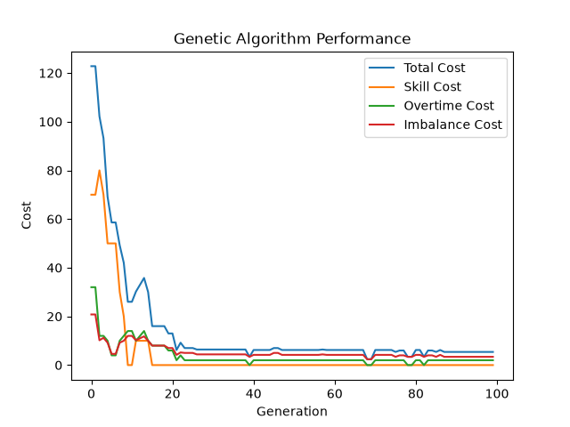
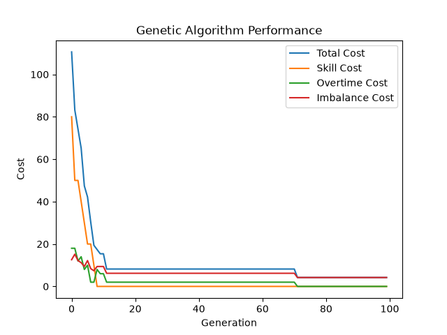

# Genetic Algorithm Task Scheduler

A task scheduling system that uses a Genetic Algorithm to assign tasks to employees while minimizing scheduling conflicts and constraint violations.

## About the Project

Assigning tasks to employees can become difficult when multiple constraints need to be considered at the same time. For example, an employee may not have the required skill for a task, assigning too many tasks to one employee may exceed their maximum working hours, or the workload may be distributed unevenly among employees.

This project uses a **Genetic Algorithm (GA)** to search for good task assignments instead of checking every possible schedule.

The algorithm currently tries to minimize:

* Skill mismatches between employees and tasks.
* Employee overtime.
* Workload imbalance between employees.

The project was built from scratch in Python to better understand how Genetic Algorithms can be applied to optimization problems.

## How It Works

Each possible schedule is represented as a **chromosome**.

Every position in the chromosome represents a task, and the value stored at that position represents the employee assigned to that task.

For example:

```text id="cqsm74"
Chromosome:

[2, 0, 4, 1]

Task 0 → Employee 2
Task 1 → Employee 0
Task 2 → Employee 4
Task 3 → Employee 1
```

A population contains multiple chromosomes representing different possible schedules.

The Genetic Algorithm improves these schedules over multiple generations using:

1. **Tournament Selection** — selects better schedules for reproduction.
2. **One-Point Crossover** — combines assignments from two parent schedules.
3. **Mutation** — randomly changes some employee assignments to maintain diversity.
4. **Elitism** — preserves the best schedules between generations.

## Cost Function

Each chromosome is evaluated using a cost function consisting of three constraints.

### Skill Mismatch

If an employee is assigned to a task without the required skill, a penalty is added to the schedule's cost.

```text id="9k9m2a"
Skill mismatch = +10 cost
```

### Overtime

If the total hours assigned to an employee exceed their maximum working hours, a penalty is added for each overtime hour.

```text id="91ilnw"
Overtime cost = overtime hours × penalty
```

### Workload Imbalance

The workload of each employee is compared with the average workload across all employees.

Larger differences from the average workload result in a higher imbalance penalty.

```text id="h8ayyd"
Imbalance cost = Σ |employee hours - average hours| × 0.5
```

The Genetic Algorithm attempts to **minimize the total cost**.

```text id="qugoyn"
Total Cost = Skill Mismatch Cost + Overtime Cost + Imbalance Cost
```

A lower cost represents a better schedule. A cost of `0` means that all current constraints have been satisfied and the workload is perfectly balanced.

## Project Structure

```text id="mb23tv"
genetic-scheduler/
├── data/
│   ├── employees.csv
│   └── tasks.csv
│
├── results/
│   ├── run1.png
│   └── run2.png
│
├── src/
│   ├── data_loader.py
│   ├── chromosome.py
│   ├── fitness.py
│   ├── selection.py
│   ├── crossover.py
│   ├── mutation.py
│   └── genetic_algorithm.py
│
├── main.py
├── pyproject.toml
├── poetry.lock
├── README.md
└── LICENSE
```

## Dataset

The dataset is divided into two CSV files:

* `employees.csv`: Contains information about the employees, including their ID, name, skills, and maximum working hours.
* `tasks.csv`: Contains the tasks that need to be assigned, including the task ID, task name, required skill, and estimated working hours.

## Running the Project

The project uses [Poetry](https://python-poetry.org/) for dependency management.

### Clone the Repository

```bash
git clone https://github.com/ahmadmrr/Genetic-Algorithm-Task-Scheduler.git
cd Genetic-Algorithm-Task-Scheduler
```

### Install Dependencies

Make sure Poetry is installed, then install the project dependencies:

```bash
poetry install
```

### Run the Scheduler

```bash
poetry run python main.py
```

## Genetic Algorithm Parameters

| Parameter       | Description                                             |
| --------------- | ------------------------------------------------------- |
| Population Size | Number of chromosomes in each generation                |
| Generations     | Number of generations                                   |
| Mutation Rate   | Probability of mutating each gene                       |
| Tournament Size | Number of chromosomes competing in tournament selection |
| Elite Size      | Number of best chromosomes preserved unchanged          |

## Visualization

The algorithm tracks the best chromosome found in each generation.

For the best chromosome, the following costs are recorded:

* Total cost
* Skill mismatch cost
* Overtime cost
* Workload imbalance cost

These values are plotted across generations to show how the solution improves during the evolutionary process and how each constraint contributes to the total cost.

## Results

The following runs demonstrate the behavior of the Genetic Algorithm using different parameter configurations.

Because Genetic Algorithms contain random operations, individual runs may produce different results even when using the same parameters. These runs are intended as examples of the algorithm's behavior rather than a statistical comparison between parameter configurations.

### Run 1

**Parameters**

| Parameter | Value |
| --- | ---: |
| Population Size | 100 |
| Generations | 100 |
| Mutation Rate | 5% |
| Tournament Size | 3 |
| Elite Size | 2 |

**Best Result**

- Best generation: **68**
- Total cost: **2.4**
- Skill mismatch cost: **0**
- Overtime cost: **0**
- Workload imbalance cost: **2.4**




### Run 2

**Parameters**

| Parameter | Value |
| --- | ---: |
| Population Size | 100 |
| Generations | 100 |
| Mutation Rate | 2% |
| Tournament Size | 7 |
| Elite Size | 2 |

**Best Result**

- Best generation: **71**
- Total cost: **4.2**
- Skill mismatch cost: **0**
- Overtime cost: **0**
- Workload imbalance cost: **4.2**



## License

This project is licensed under the MIT License. See the `LICENSE` file for details.
