# Genetic Algorithm Experiments

Genetic algorithms are stochastic. One lucky run tells me almost nothing about
whether a configuration is actually good.

So instead of choosing the GA parameters from a few individual runs, I tested
them across repeated executions.

Three GA parameters were investigated:

- Crossover operator
- Mutation rate
- Tournament size

Each configuration was run **30 times**, producing **330 runs** across the
three parameter experiments.

After that, the strongest setting observed in each experiment was combined
into one configuration and tested for another **30 runs**.

**Total: 360 GA runs.**

---

## Setup

The parameter experiments started from this baseline configuration:

```toml
population_size = 200
generations = 500
mutation_rate = 5
tournament_size = 7
elite_size = 4
crossover_type = "uniform"
```

Only one parameter was changed at a time.

Each run records:

- Total cost
- Skill mismatch cost
- Overtime cost
- Workload imbalance cost
- Proficiency cost
- Priority imbalance cost
- Best generation
- Execution time

I also track how often a run finishes with:

- **No Skill Mismatch** → `skill_mismatch_cost == 0`
- **No Overtime** → `overtime_cost == 0`
- **Both Satisfied** → both conditions above are satisfied

---

# 1. Crossover

I compared the three crossover operators implemented in the scheduler:

`one_point` · `two_points` · `uniform`

Each operator was tested across **30 independent runs**.

## Results

| Crossover | Avg Cost | Median | Best | Worst | Std Dev | Avg Runtime |
|---|---:|---:|---:|---:|---:|---:|
| One Point | 114.67 | 111.70 | 89.70 | 172.64 | 17.13 | 7.52 s |
| Two Points | 111.43 | 107.23 | **86.34** | 139.70 | 14.24 | 7.78 s |
| Uniform | **105.86** | **102.82** | 92.76 | **135.94** | **10.40** | 7.69 s |

<p align="center">
  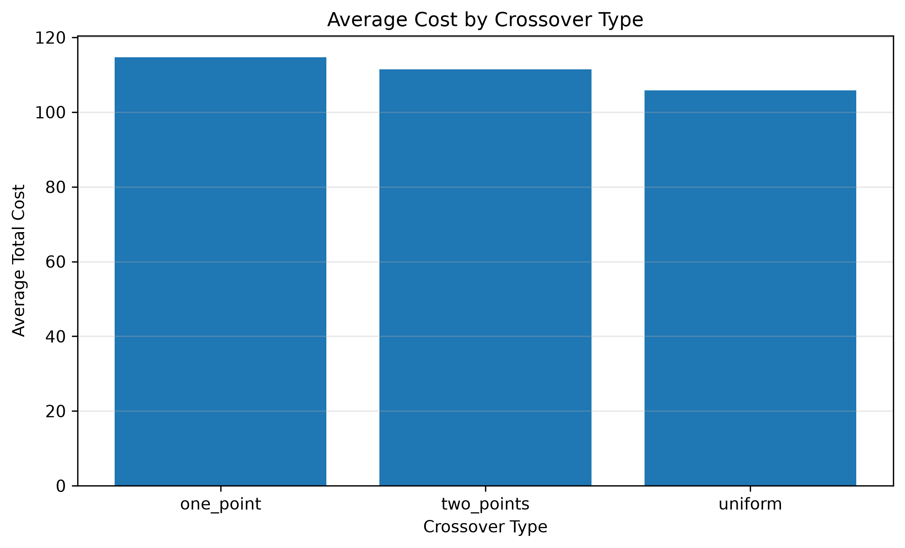
</p>

<p align="center">
  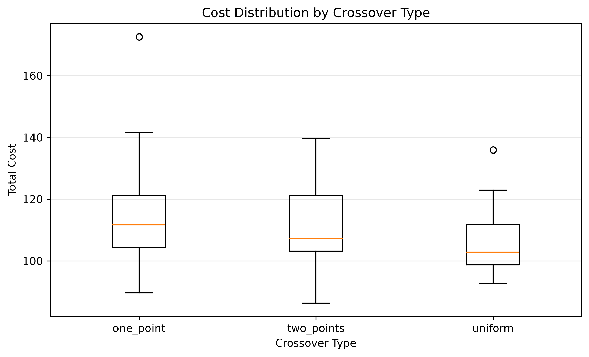
</p>

### What happened?

Uniform crossover had the lowest average cost and the smallest standard
deviation.

Two-point crossover produced the best individual run at **86.34**, but uniform
was more consistent across the full 30 runs.

Uniform also reached:

- **100%** no-skill-mismatch rate
- **53.33%** zero-overtime rate
- **53.33%** with both satisfied

Runtime stayed around 7–8 seconds for all three operators, so crossover choice
did not create a meaningful runtime difference in this experiment.

<details>
<summary><b>More crossover plots</b></summary>

<br>

### Cost Components

<p align="center">
  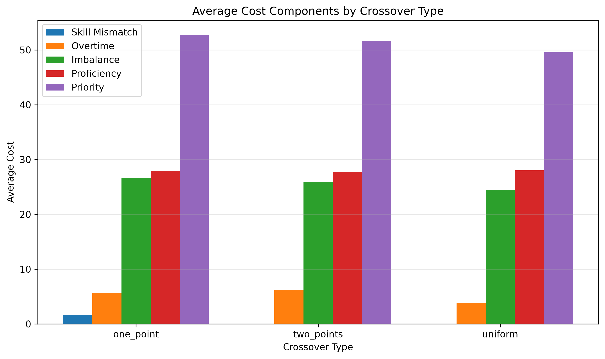
</p>

### Constraint Satisfaction

<p align="center">
  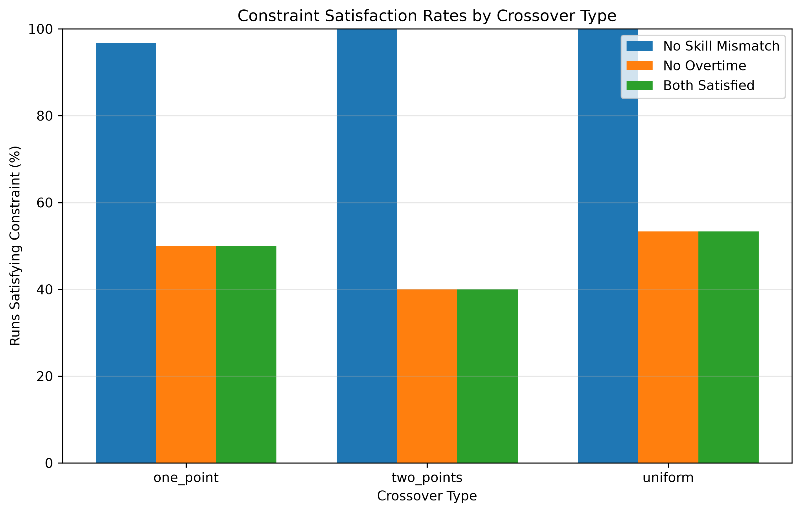
</p>

### Execution Time

<p align="center">
  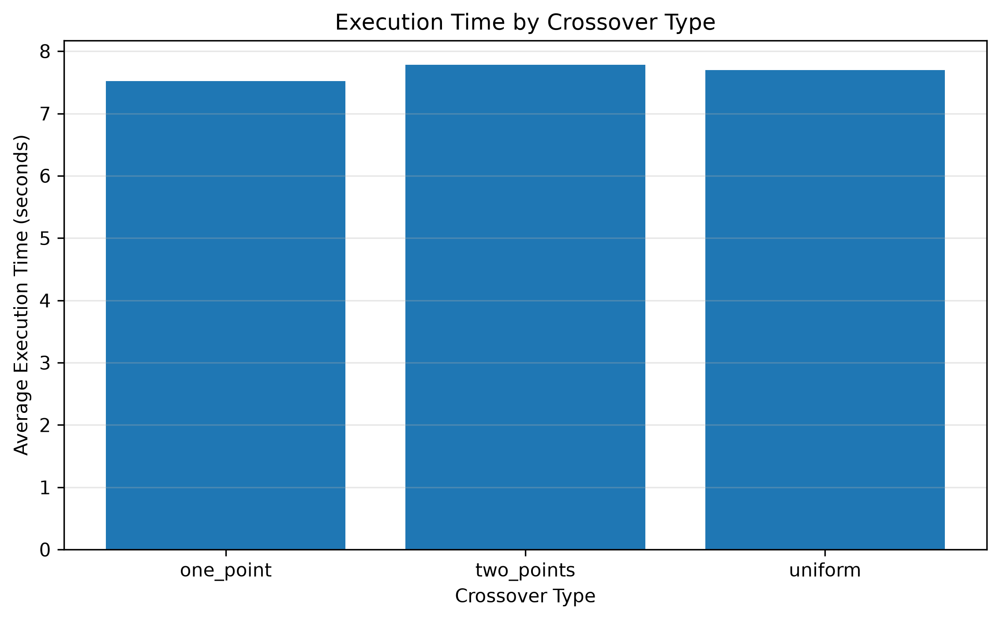
</p>

</details>

---

# 2. Mutation Rate

Next, I tested four mutation rates:

`1%` · `3%` · `5%` · `10%`

Each value was tested across **30 independent runs**.

## Results

| Mutation Rate | Avg Cost | Median | Best | Worst | Std Dev | Avg Runtime |
|---|---:|---:|---:|---:|---:|---:|
| 1% | 90.93 | 88.33 | 80.68 | 119.08 | 8.73 | **7.03 s** |
| 3% | **86.30** | **85.82** | **77.64** | **97.76** | **5.03** | 7.31 s |
| 5% | 103.75 | 100.33 | 83.66 | 133.56 | 10.02 | 7.51 s |
| 10% | 467.22 | 457.33 | 353.20 | 562.34 | 63.44 | 8.07 s |

<p align="center">
  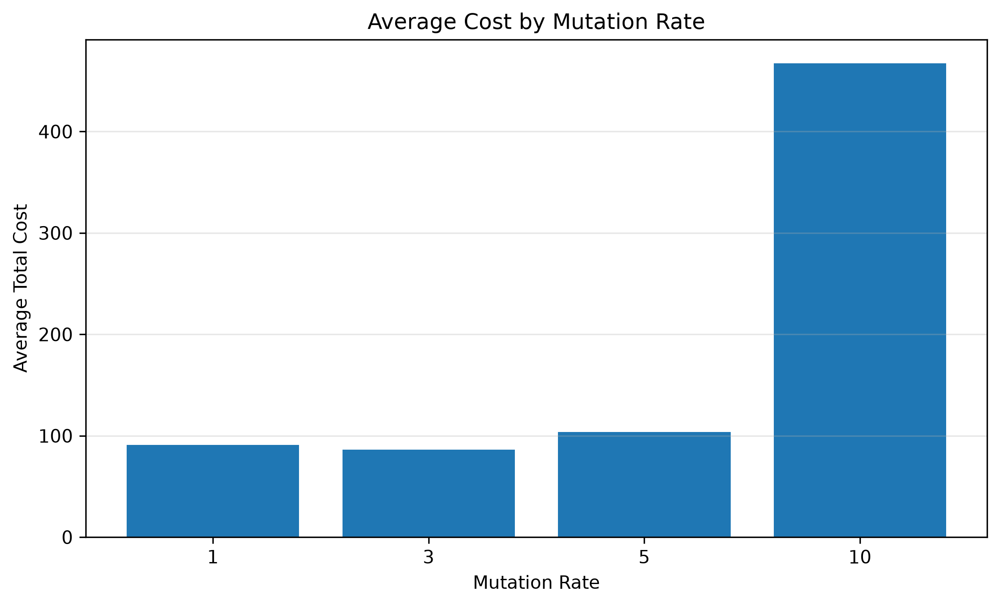
</p>

<p align="center">
  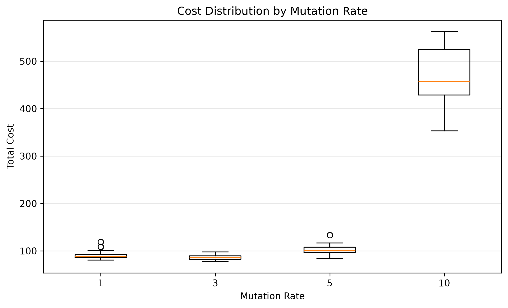
</p>

### What happened?

**3% was the strongest mutation rate in this experiment.**

It produced:

- Lowest average cost: **86.30**
- Lowest median cost: **85.82**
- Best individual cost: **77.64**
- Lowest standard deviation: **5.03**
- **93.33%** of runs with both zero skill mismatch and zero overtime

The 1% mutation rate was also strong, but slightly worse overall.

At 5%, performance started dropping.

Then there was 10%.

The average cost jumped from **86.30 at 3%** to **467.22 at 10%**.
None of the 30 runs at 10% reached zero skill mismatch or zero overtime.

At that mutation rate, useful chromosome structures were being changed too
aggressively for this problem.

<details>
<summary><b>More mutation-rate plots</b></summary>

<br>

### Cost Components

<p align="center">
  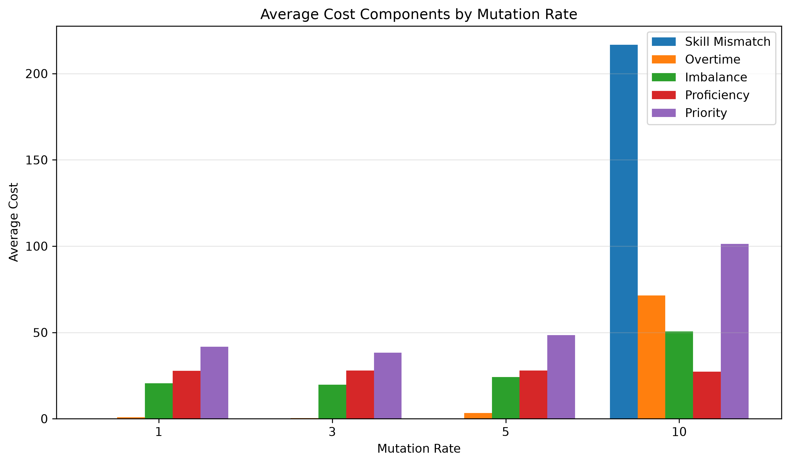
</p>

### Constraint Satisfaction

<p align="center">
  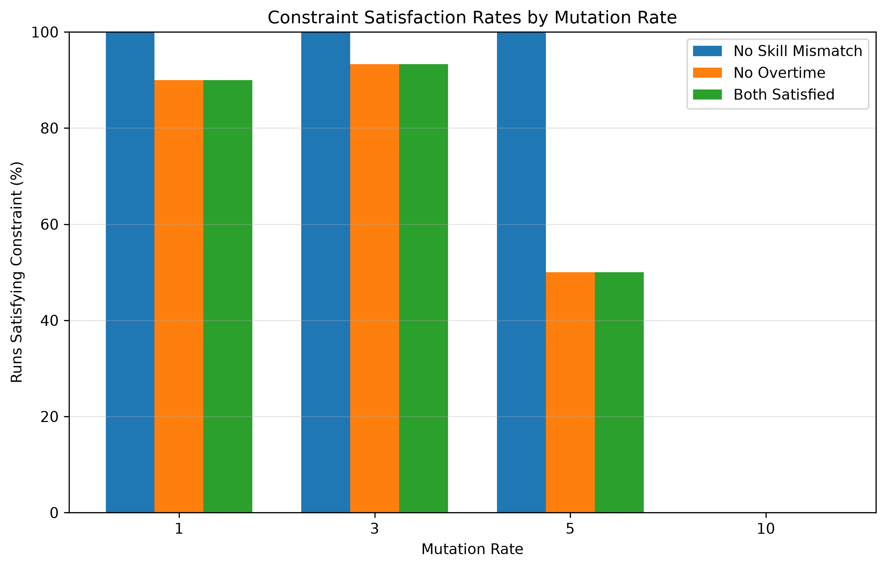
</p>

### Execution Time

<p align="center">
  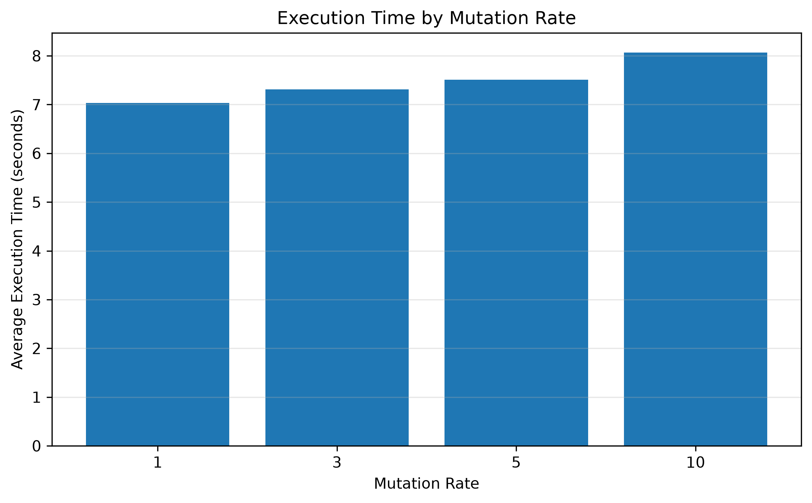
</p>

</details>

---

# 3. Tournament Size

Finally, I tested four tournament sizes:

`3` · `5` · `7` · `9`

Each size was tested across **30 independent runs**.

## Results

| Tournament Size | Avg Cost | Median | Best | Worst | Std Dev | Avg Runtime |
|---|---:|---:|---:|---:|---:|---:|
| 3 | 207.03 | 202.11 | 145.18 | 292.88 | 35.36 | **7.63 s** |
| 5 | 127.85 | 127.72 | 105.76 | 176.76 | 14.54 | 7.70 s |
| 7 | 100.21 | 99.92 | 85.58 | 114.90 | 8.60 | 7.67 s |
| 9 | **97.20** | **98.64** | **83.06** | **111.12** | **7.23** | 7.83 s |

<p align="center">
  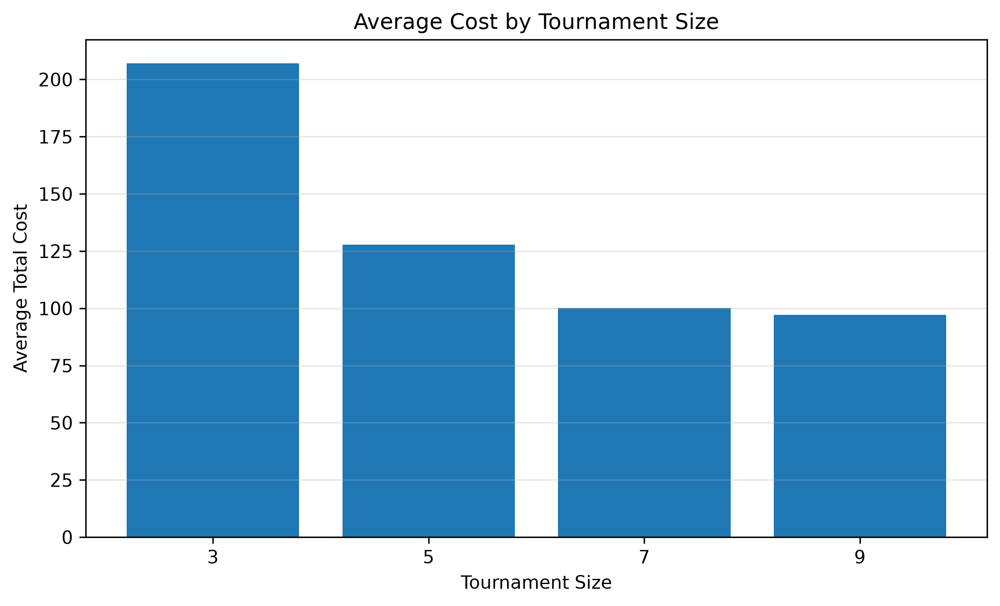
</p>

<p align="center">
  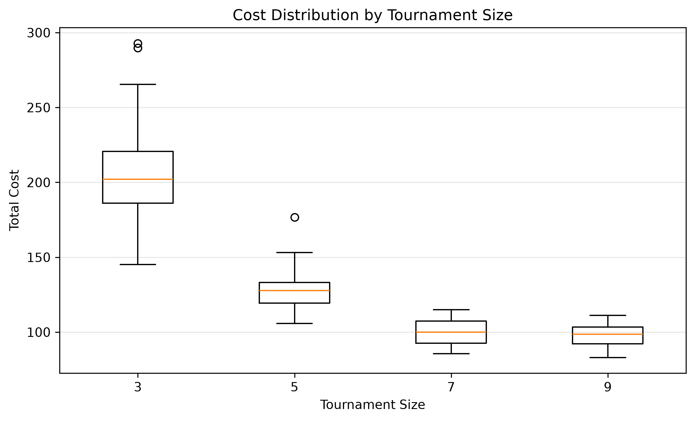
</p>

### What happened?

Tournament size had a clear trend in this experiment.

Average cost dropped from:

```text
Tournament 3 → 207.03
Tournament 5 → 127.85
Tournament 7 → 100.21
Tournament 9 →  97.20
```

The results also became more consistent.

Standard deviation dropped from **35.36 at size 3** to **7.23 at size 9**.

Constraint satisfaction followed the same pattern:

| Tournament Size | No Skill Mismatch | No Overtime | Both Satisfied |
|---|---:|---:|---:|
| 3 | 76.67% | 0.00% | 0.00% |
| 5 | 93.33% | 13.33% | 10.00% |
| 7 | 100.00% | 56.67% | 56.67% |
| 9 | 100.00% | **73.33%** | **73.33%** |

Within the tested range, tournament size **9** gave the strongest overall
results.

<details>
<summary><b>More tournament-size plots</b></summary>

<br>

### Cost Components

<p align="center">
  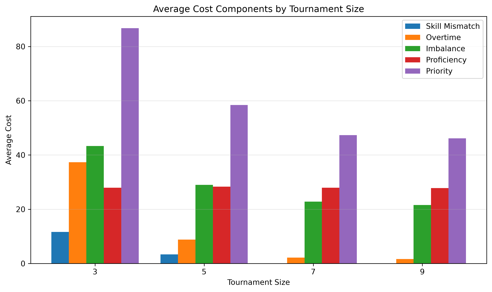
</p>

### Constraint Satisfaction

<p align="center">
  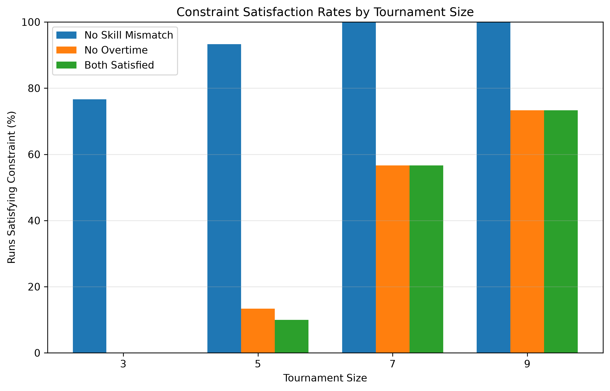
</p>

### Execution Time

<p align="center">
  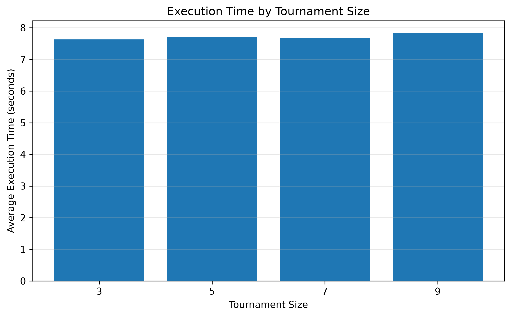
</p>

</details>

---

# 4. Combined Configuration

The first three experiments identified the strongest observed setting for each
parameter:

| Parameter | Setting |
|---|---|
| Crossover | `uniform` |
| Mutation Rate | `3%` |
| Tournament Size | `9` |

Those experiments changed one parameter at a time, so they did not show whether
these settings would still perform well when used together.

To test that, I combined all three settings and ran the resulting configuration
another **30 times**.

## Configuration

```toml
runs = 30

population_size = 200
generations = 500
mutation_rate = 3
tournament_size = 9
elite_size = 4
crossover_type = "uniform"
```

## Results

| Metric | Result |
|---|---:|
| Average Cost | **85.87** |
| Median Cost | **85.59** |
| Best Cost | **73.36** |
| Worst Cost | **97.34** |
| Standard Deviation | **5.18** |
| Average Best Generation | 340.67 |
| Average Runtime | 7.17 s |
| No Skill Mismatch | **100%** |
| No Overtime | **93.33%** |
| Both Satisfied | **93.33%** |

<p align="center">
  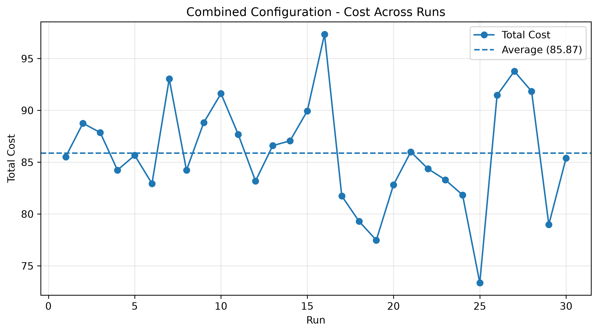
</p>

<p align="center">
  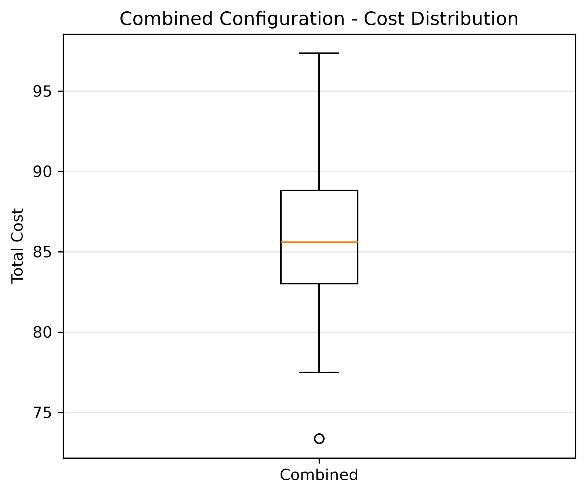
</p>

### What happened?

The combined configuration performed consistently across the 30 runs.

Every run finished with **zero skill mismatch**, and **28 out of 30 runs**
also finished with zero overtime. That means **93.33%** of the runs satisfied
both constraints.

The average total cost was **85.87**, while the best run reached **73.36**.
Even the worst run stayed at **97.34**.

The standard deviation was only **5.18**, which shows that the configuration
did not depend on a few unusually lucky runs to produce good results.

The average best solution was found around generation **341** out of 500.

<details>
<summary><b>Average cost components</b></summary>

<br>

<p align="center">
  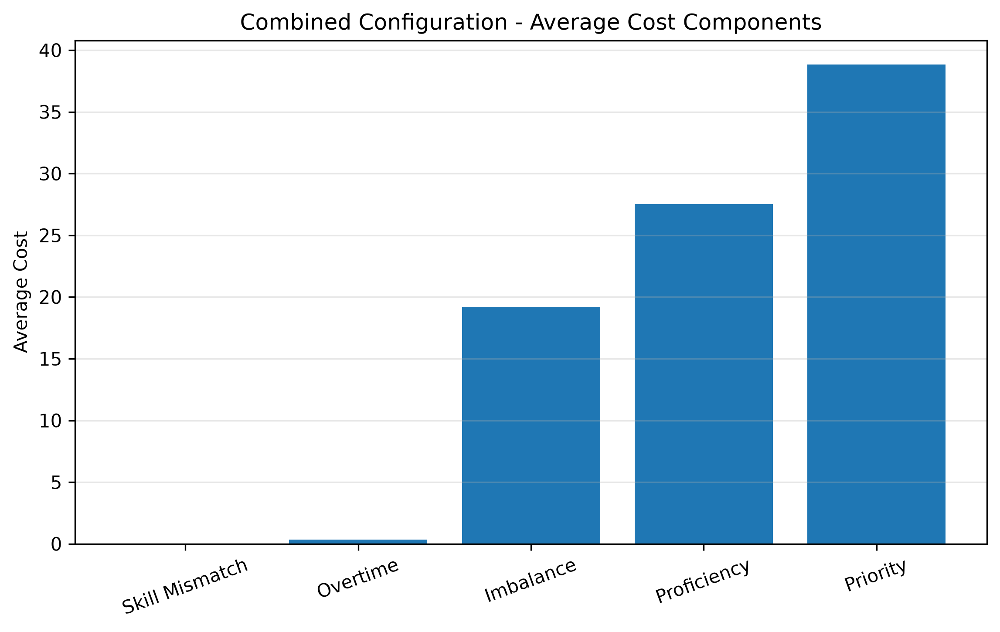
</p>

The average cost was made up of:

| Component | Average Cost |
|---|---:|
| Skill Mismatch | **0.00** |
| Overtime | **0.33** |
| Workload Imbalance | 19.15 |
| Proficiency | 27.54 |
| Priority Imbalance | 38.85 |

The remaining cost mostly came from the balancing objectives rather than
constraint violations.

</details>

---

# What I Learned

After **360 total GA runs**, a few things became pretty clear.

### Mutation can destroy a good search

Increasing mutation does not automatically mean better exploration.

For this scheduler, moving from 3% to 10% mutation increased average cost from:

```text
86.30 → 467.22
```

The GA was introducing diversity, but far too much of it.

### Selection pressure mattered

Tournament size 3 performed poorly compared with the larger tournament sizes.

Increasing tournament size improved both average solution quality and
consistency throughout the tested range.

### One lucky run is not enough

Two-point crossover produced the best individual crossover result, but uniform
crossover performed better across the full set of runs.

That is exactly why these experiments use repeated runs instead of comparing
one execution from each configuration.

### Good settings still need to be tested together

The individual experiments pointed toward:

```text
uniform crossover
3% mutation
tournament size 9
```

But those results came from one-parameter-at-a-time experiments.

When all three settings were combined and tested across another 30 runs, the
configuration produced:

```text
Average cost:          85.87
Median cost:           85.59
Best cost:             73.36
Worst cost:            97.34
Standard deviation:     5.18

No skill mismatch:    100.00%
No overtime:           93.33%
Both satisfied:        93.33%
```

So the settings that performed strongly on their own also produced strong and
consistent results when combined.

### Runtime was not the deciding factor

Most configurations took roughly **7–8 seconds per run**.

The combined configuration averaged **7.17 seconds**, so its improvement did
not come with a meaningful runtime penalty.

The important differences came from solution quality and consistency rather
than execution speed.

> **Note**
>
> These experiments evaluate the tested configurations on this scheduler,
> fitness function, and dataset.
>
> The results support the selected configuration for this project, but they do
> not prove that it is globally optimal or that the same parameters will be
> strongest for every scheduling problem.

---

# Running the Experiments

Experiment settings are controlled through:

```text
config/experiment.toml
```

The experiment runner supports two modes.

## Parameter Comparison

To compare values of one parameter, provide that parameter as a list:

```toml
runs = 30

population_size = 200
generations = 500
mutation_rate = [1, 3, 5, 10]
tournament_size = 7
elite_size = 4
crossover_type = "uniform"
```

Only **one parameter** can be a list at a time.

The runner tests every value independently for the configured number of runs.

For example:

```toml
mutation_rate = [1, 3, 5, 10]
runs = 30
```

produces:

```text
4 configurations × 30 runs = 120 GA runs
```

## Configuration Test

A complete configuration can also be tested without using any lists:

```toml
runs = 30

population_size = 200
generations = 500
mutation_rate = 3
tournament_size = 9
elite_size = 4
crossover_type = "uniform"
```

In this mode, the exact same configuration is executed repeatedly.

This is useful for checking the consistency of a complete parameter
configuration rather than comparing individual values.

## Running

Start an experiment with:

```bash
poetry run python -m experiments.main
```

The experiment runner automatically:

1. Detects whether the experiment is a parameter comparison or configuration test.
2. Runs the required configurations for the requested number of repetitions.
3. Records every result in CSV.
4. Copies the experiment configuration into the result directory.
5. Generates visualizations for the experiment type.
6. Stores everything in a separate experiment directory.

---

## Experiment Output

A parameter comparison produces a directory such as:

```text
experiments/results/
└── mutation_rate_<timestamp>/
    ├── experiment.toml
    ├── results.csv
    └── plots/
        ├── mutation_rate_average_cost.png
        ├── mutation_rate_cost_distribution.png
        ├── mutation_rate_cost_components.png
        ├── mutation_rate_constraint_satisfaction.png
        └── mutation_rate_execution_time.png
```

Configuration tests use visualizations designed for repeated runs of one
configuration:

```text
experiments/results/
└── configuration_<timestamp>/
    ├── experiment.toml
    ├── results.csv
    └── plots/
        ├── configuration_costs.png
        ├── configuration_cost_distribution.png
        └── configuration_cost_components.png
```

This keeps every experiment separate and prevents newer runs from overwriting
previous results.

---

## Raw Results

The CSV files contain every individual run used in the analysis above.

The tables, statistics, and plots are based on the complete results rather than
selected runs.